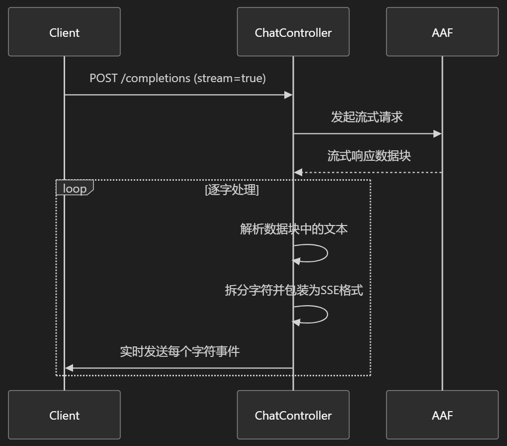
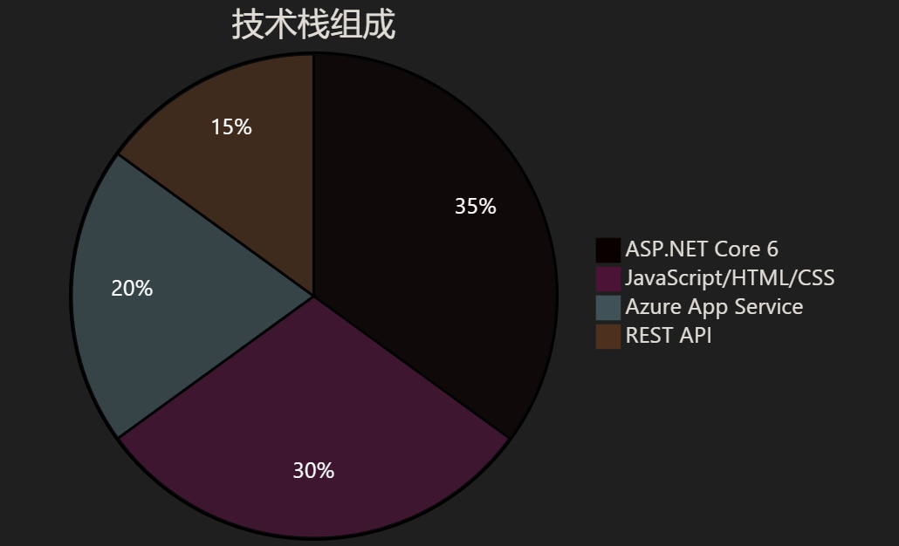
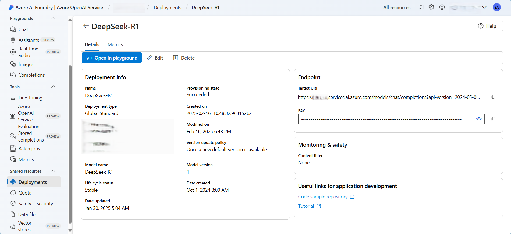
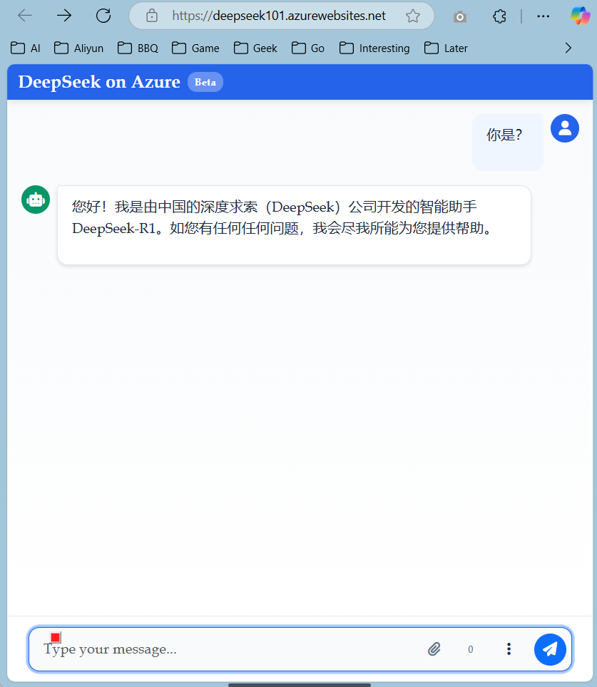
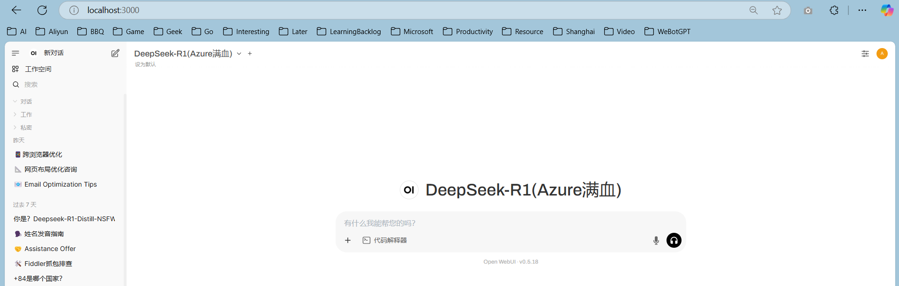
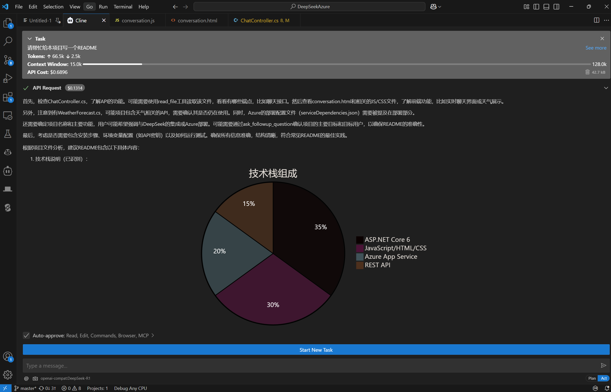

# DeepSeekAzure
Deploy your own deepseek-r1 on Azure and integrate with VsCode Cline and Open WebUI etc.

## Features
This project serves as an adapter (relay/converter) for DeepSeek-R1. Currently, the full version of DeepSeek-R1 created in Azure AI Foundry does not natively support the OpenAI Compatible API. This adapter performs the necessary conversions to enable integration of the full DeepSeek-R1 with applications such as Cline or Open WebUI.


## Technology Stack


## Quick Start
```bash
# Clone repository
git clone https://github.com/your-account/DeepSeekAzure.git
cd DeepSeekAzure

# Restore NuGet packages
dotnet restore

# Run the application
dotnet run --project DeepSeekAzureApi.csproj
```
Create a DeepSeek-R1 service in AAF (Azure AI Foundry) and obtain the Endpoint and Key:


Enter the Endpoint and Key into the appsettings.json file of the DeepSeekAzureApi project.

Deploy the project to Azure App Service.

Access the project directly (conversation.html) to chat with the AI:


Or integrate the project with Open WebUI:


Or integrate with applications, extensions, and plugins like Cline:


---
---
---

# DeepSeekAzure
在Azure上部署你自己的满血版DeepSeek-R1，将其接入你自己的VsCode Cline或Open WebUI等。

## 功能特性
这个项目是一个适配器（中转站/转接器）：目前在Azure AI Foundry里面创建的满血版DeepSeek-R1默认不支持OpenAI Campatible的Api，需要做一些适配工作，从而可以将满血DeepSeek-R1接入例如Cline或Open WebUI等应用。


## 技术栈


## 快速开始
```bash
# 克隆仓库
git clone https://github.com/your-account/DeepSeekAzure.git
cd DeepSeekAzure

# 还原NuGet包
dotnet restore

# 启动应用
dotnet run --project DeepSeekAzureApi.csproj
```
在AAF中（Azure AI Foundry）创建DeepSeek-R1服务，拿到Enpoint和Key：


将Enpoint和Key填入DeepSeekAzureApi项目的appsettings.json文件中。

将项目发布到Azure App Service。

直接访问项目（conversation.html）与AI进行对话：


或将项目集成到Open WebUI：


或集成到Cline等应用、扩展与插件当中：

